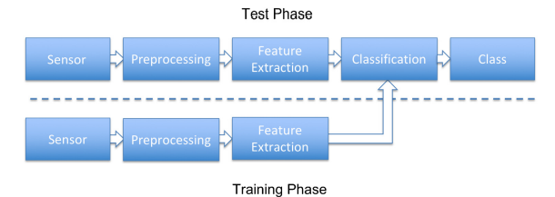
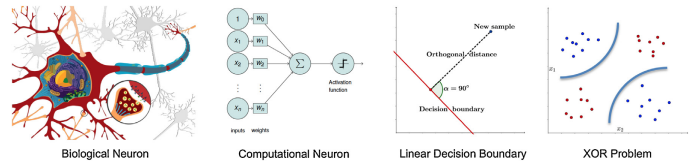
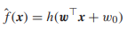
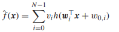
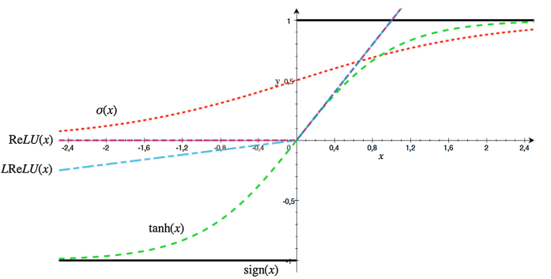

A Gentle Introduction to Deep Learning in Medical Image Processing
==============================

Metadata
------------

| **Title**           | [A gentle introduction to deep learning in medical image processing](https://doi.org/10.1016/j.zemedi.2018.12.003) |
|:--------------------|:-------------------------------------------------------------------------------------------------------------------|
| **Authors**         | Andreas Maier Christopher Syben Tobias Lasser Christian Riess                                          |
| **Publisher**       | Elsevier                                                                                                           |
| **Publishing Date** | May 2019                                                                                                           |
| **DOI**             | [https://doi.org/10.1016/j.zemedi.2018.12.003](https://doi.org/10.1016/j.zemedi.2018.12.003)                       |

Abstract
------------

* The paper will mainly attempt to discuss the following:
    * Why deep learning became popular
    * Mention several breakthroughs in computer science
    * The fundamentals of perceptron and neural networks
    * Discuss medical image processing
        * Image detection and recognition
        * Image segmentation
        * Image registration
        * Computer-aided diagnosis
        * Physical simulation, modeling, and reconstruction, bear the risk of implausible results

Introduction
------------

* Deep learning has vastly improved in the recent years, especially in:
    * Speech recognition
    * Image recognition
    * Training artificial agents that beat human players
    * Creating artistic new images and music
* Deep learning can also be applicable in the medical field
* Medical imaging has evolved rapidly and is being quickly adopted; a vast number of literatures have been published,
  making it difficult to create a review paper that matches the current pace in the field
* The authors state that readers do not have to be closely acquainted with deep learning at its terminology
* The authors will attempt to carry out the following in their paper:
    * Summarize relevant theory
    * Connect the observations with traditional concepts in pattern recognition and machine learning
    * Such foundations will be put into the context of the emerging approaches in medical image processing and analysis
    * Indicate potential weakness in the current technology and outline potential remedies

Materials and methods
------------

### Introduction to machine learning and pattern recognition

* Machine learning and pattern recognition attempts to automatically find a decision (separating apples from pears)

> #### Pattern recognition system
> 
> * During th training phase:
>     * Preprocess the dataset (such as noise reduction)
>     * Extract meaningful features (devise an algorithm that extract distinctive and complete feature representation)
> * Feature extraction is difficult to generalize
> * Feature extraction is commonly called as **hand-crafting** in the deep learning literature

### Neural networks

> #### Neural network representation and the XOR problem
> 
> * The fundamental unit of the neural network is a neuron
> * A single neuron can only solve linear problem (it can't even solve the XOR problem)
> * Introducing multiple neurons with a proper activation function will allow the network to solve non-linear problems
>
> A single neuron can be represented by the following formula:
>
> 
>
> Where ***w0*** denotes the bias, ***w*** is the weight vector, and ***h()*** is the activation function
>
> A collection of neurons can be represented by the following formula:
>
> 

* Given a large number of neurons, any function can be approximated using a single layer network only (applicable on the
  training set only)
* The author conducted an experiment which concluded that deeper networks may have more modeling capacity.

### Network training

* The parameters ***Θ*** is computed by using gradient descend based on a loss function ***L(Θ)***
* ***Back-propagation*** is commonly used to efficiently compute gradients for neural network training

### Deep Learning

> #### Activation functions
> 
> * Unlike classical bounded activation functions (such as ***sign(x)***, ***σ(x)***, and ***tanh(x)***), new functions
    functions (such as ***ReLU(x)*** and ***LReLU(x)***) are proven to be useful in training deeper networks

* The major advantage of the convolution layers is that they only consider a local neighborhood for each neuron, and
  that all neurons of the same layer share the same weights, which reduces the amount of parameters and therefore memory
  required to store such a layer
* Pooling is used to reduce the scale of the input
* If the loss is highly increasing at the beginning of the iterations, it could mean that the training rate (η) is high,
  this is referred to as *exploding gradient*
* If the learning rate (η) is too low, it can result in a stagnation of the loss over iterations.
* Hyperparameters tuning is imperative
* Validation set is used to identify whether there is over-fitting or not
* Validation set is not used for weights adjustments, but rather estimate for the error on unseen data
* hyperparameter tuning has to be done on validation data before actual test data is employed
* It is advisable to perform multiple training runs with different initialization techniques to avoid local minimum
* Output of a neural network does not equal to confidence, even if they are scaled between 0 and 1 and appear like
  probabilities, e.g. when using softmax function
* The availability of large amount of data, and powerful computational power, has enabled the extremely fast rise of
  deep learning

### Important architectures in deep learning

* **Autoencoders**
    * Use a contracting and an expanding branch to find representations of the input of a lower dimensionality
* **Generative adversarial networks (GANs)**
    * Employ two networks:
        * Generator network: creates new images from a noise input
        * Discriminator network: attempts to differentiate real images from generated images
    * Both networks are trained in an alternating manner such that both gradually improve for their respective tasks
* **Google’s inception network**
    * An advanced deeplearning architecture
    * Introduced an "inception" block that allows to compute convolutions and pooling operations in parallel.
* **Ronneberger’s U-net**
    * A breakthrough towards automatic image segmentation
    * Has been applied successfully in many tasks that require image-to-image transforms
* **ResNet**
    * Designed to enable training of very deep networks
    * Varies from 30 to 50 layers
* **Variational networks**
    * Enable the conversion of an energy minimization problem (many problems in traditional medical image processing are
      expressed as such) into a neural network structure
    * Variational units (formed from the gradient of the original problem) generally form residual blocks, and thus
      variational networks are always ResNets as well
* **Recurrent neural networks(RNNs)**
    * Enables the processing of sequences with long term dependencies
    * Allow the cells to carry memory (by using state variables) and model any finite state machine
    * Extensions:
        * Long-short-term memory (LSTM)
        * Gated recurrent units (GRU)

### Advanced deep learning concepts

* **Data augmentation**
    * Mutates the training set by using:
        * Noise
        * Changing contract
        * Rotation
        * Translation
    * Helpful in biased data
* **Precision learning**
    * Include known operators into the learning process
    * Reduces the maximal training error
    * Reduces the number of unknowns
    * Hence, reduces the number of required training samples
* **Adversarial examples**
    * Consider the input to a neural network as a possible weak spot that could be exploited by an attacker
    * Attacks range from generating noise that will mislead the network, but will remain unnoticed by a human observer,
      to specialized patterns that will even mislead networks after printing and re-digitization
* **Deep reinforcement learning**
    * Allows to train an artificial agent to perform actions given inputs from an environment (expands on traditional
      reinforcement learning theory)

Results
------------

* Approximately 70% of all accepted publications were related to the topic of deep learning on the **international
  conference of Medical Image Computing and Computer-Assisted Intervention (MICCAI)**

### Image detection and recognition

* Deals with detecting a certain element in a medical image
* In many cases in the medical field, images are volumetric, efficient parsing is required, approaches are:
    * Marginal space learning
    * A deep learning efficient counterpart, is implemented by replacing the probabilistic boosting trees with a neural
      network-based boosting cascade
* Applications:
    * Anatomical landmarks detection on 2D X-ray projection images
    * Tumors detection on mammographic images
    * Cell detection/classification
    * Motion artifacts detection in confocal laser-endoscopy images

### Image segmentation

* Determines the outline of an organ or anatomical structure as accurately as possible
* Applications:
    * Brain MRI segmentation
    * Multi-slice MRI cardiac data segmentation

### Image registration

* Comparing to image detection and classification, image registration did not receive that much of attention
* Point-based registration problem: find good feature descriptors that allow correct identification of corresponding
  points, solution:
    * Use auto-encoders
    * Use the registration metric itself as loss function for learning good feature representations
    * Estimate the 3D pose directly from the 2D point features (applicable on 2-D/3-D registration problems)

### Computer-aided diagnosis

* One of the most challenging problems in the field of medical image processing
* Highly sensitive, must be reliable
* Applications:
    * Chest radiographs analysis
    * Reading of volumetric optical coherence tomography data
    * Automatic cancer assessment in confocal laser endoscopy in different tissues of the head and neck
    * Mammogram analysis
    * Skin cancer classification

### Physical simulation

* Support of physical modeling, so far, implemented in gaming engines.
* Attempts to bring deep learning to biomedical modeling
* Applications:
    * Deep scatter estimation
    * Emulate the complete X-ray formation process
    * Efficient generative noise model for realistic physical simulations
    * Material decomposition using deep learning embedding prior physical operators using precision learning
    * Convert MRI volumes to CT volumes
    * Predicting X-ray projections from MR projection images

### Image reconstruction

* Applications:
    * MRI reconstruction
    * Speed reconstruction
    * Bayesian deep learning, outputs the reconstructed image plus a confidence map on how accurate the content of the
      reconstructed image was actually measured
    * Motion compensated reconstruction using deep learning-based motion tracking

Discussion
------------

* In image registration, deep learning is not that broadly used
* Computer-aided diagnosis is a hot topic with many recent publications address, however, deep networks that immediately
  result in a decision are not that well suited
* Physical simulation can be accelerated dramatically with realistic outcomes
* Reconstruction based on data-driven methods yield impressive results, but suffer from deep learning artifacts
* CNN architectures that emerge from deep learning are computationally efficient, however, computationally exhaustive in
  training time
* One of the limitations of deep learning is that it is data hungry, such that it is ineffective on small datasets
* Deep learning computational time grows logarithmically with the amount of data fed

Conclusion
------------

* The main objectives in this paper were:
    * Introduce to the field of deep learning and the associated theory
    * Provide a general overview on the field and potential future applications
* The authors believe that deep learning models can solve problems better than the classical state-of-the-art algorithms
  does
* Understanding of neural networks is still a large concern, however, methods are being developed to handle such problem
* The author believe that deep learning will probably remain an active research field for the coming years

--------