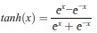
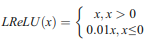

A Review of Deep Learning on Medical Image Analysis
==============================

Metadata
------------

| Title               | [A Review of Deep Learning on Medical Image Analysis](https://doi.org/10.1007/s11036-020-01672-7) |
|:--------------------|:--------------------------------------------------------------------------------------------------|
| **Authors**         | Jian Wang Hengde Zhu Shui-Hua Wang Yu-Dong Zhang                                      |
| **Publisher**       | Springer                                                                                          |
| **Publishing Date** | November 2020                                                                                     |
| **DOI**             | [https://doi.org/10.1007/s11036-020-01672-7](https://doi.org/10.1007/s11036-020-01672-7)          |

Abstract
------------

* Unlike common deep learning methods, transfer learning is characterized by simplicity, efficiency and its low training
  cost
* Common medical image acquisition methods:
    * Computer Tomography (CT)
    * Magnetic Resonance Imaging (MRI)
    * Ultrasound (US)
    * X-Ray
* The paper will mainly attempt to discuss the following:
    * The structure of CNN
    * Background knowledge of transfer learning
    * Different types of strategies performing transfer learning
    * Application of transfer learning in various subfields of medical image analysis
    * Discussion on the future prospect of transfer learning in the field of medical image analysis.

Introduction
------------

* Medicine has always been one of the most highly regarded disciplines in the world
* Medical image means (considered non-invasive imaging techniques):
    * Computer Tomography (CT): has higher resolution on tissue of high density, but relies on doctor’s skill
    * Magnetic Resonance Imaging (MRI): no ionizing radiation, takes long time, unsuitable for those who wear metal
      medical instruments
    * Ultrasound (US): can detect movements
    * X-Ray: convenient and low-price, harmful however when used many times
* Medical image means are used on:
    * Brain
    * Heart
    * Chest
    * Lung
    * Kidney
    * Liver
    * etc.
* Artificial-based medical image analysis relies on the expertise of an experienced physician to identify the image with
  naked eyes, problems:
    * The number of doctors who can perform medical image analysis is extremely limited
    * Human eyes could be fatigued
* Convolutional neural networks (CNN) has far advanced the automatic medical image analysis began
* CNN medical image analysis tasks:
    * Segmentation
    * Detection
    * Classification
    * Disease prediction
* CNNs generally have a high accuracy and a fast analysis speed
* CNN shortcomings:
    * Needs to be trained before it can perform tasks (difficult and long)
    * Most algorithms based on convolutional neural network structure rely heavily on large number of labeled samples
      for learning
    * Medical image labeling can only be done by professional doctors; making it more scarce
* In order to overcome such shortcoming, transfer learning has been introduced from CNN
* Transfer learning idea: if a convolutional neural network is successful in solving a problem, it must have
  successfully learned something which could be transferred to another similar problem
* Transfer learning can take advantage of the pre-trained network as the basis without training from scratch
* Transfer learning only needs a small amount of labeled data to fine-tune a pre-trained network structure (suitable for
  medical image analysis)
* Common strategies for applying transfer learning in medical image analysis:
    * Fine-tuning: Utilize the tagged medical image data
    * Feature extractor: Freeze all the other layers in pre-trained networks except for the last few layers, and then
      splice its own classifier reconstructing a new network model
* Fine-tuning is for abundant medical images dataset, while feature extractor is for scarce datasets (to avoid
  overfitting)
* Fine-tuning and feature extractor determine how many layers in the pre-trained networks participate in updating
  parameters during retraining process
* Transfer learning has been widely and deeply applied in medical image analysis
* The next paragraphs will discuss the following:
    * Introduce the background knowledge of convolutional neural networks, and where transfer learning originated
    * Introduced the formal definition and categories of transfer learning
    * Review application of transfer learning in the field of medical image analysis
    * Discussed the integration of transfer learning with other deep learning technologies and the future trend
    * Provide conclusion

Convolutional Neural Network
------------

* Without the development and expansion of CNN, there will be no great prospect of transfer learning in the field of
  medical image processing
* A significant amount of transfer learning approaches are based on CNN
* Common strategies of applying transfer learning:
    * Utilize a classic convolutional neural network as pre-trained model, freeze some layers and then retrain a few
      layers by data in target domain
    * Cut off part of layers in pre-trained model as feature extractor then add another classifier such as Support
      Vector Machine (SVM)
* Popular pre-trained models applied in transfer learning medical images analysis:
    * AlexNet
    * VGGNet
    * ResNet

### Overall Structure

* CNN generally includes:
    * Convolutional layers: used to extract the features of the input image
    * Pooling: reduce the resolution of features maps
    * Activation: introduce nonlinear factors and improve the expression ability of neural network
    * Fully connected layers: reduce the dimension of feature maps and act as a classifier
* Softmax is usually used as the output layer (maps the probability of the result between 0 and 1)
* Deeper structure brought better results

### Convolutional Layers

* Generally followed by the input layer to extract feature from the input layer
* The convolutional kernel in the traditional convolutional layer is similar to the filter in signal processing
* Convolutional kernel is only sensitive to images with specific features
* CNN usually contains multiple convolutional layers
* Former convolutional layer extracts some basic features, while the latter convolutional layer extracts advanced
  features from the basic features
* Essential parameters of convolution:
    * Kernel size
    * Input image’s size
    * Padding: supplement extra pixels of value zero around the input image to ensure convolutional neural networks
      reaching deeply as we need
    * Stride
    * Output feature map’s size

#### Standard Convolution

* Simplest and most classic convolution structure
* No padding and a stride of one

#### Strided Convolution

* Strided convolutional kernel is shifted by more than 2 pixels at a time
* No padding and a stride of one
* Obtain smaller feature maps and achieve the effect similar to pooling to some extent

#### Grouped Convolution

* Reduces the quantity of parameters
* First proposed in AlexNet
* Divides convolutional kernels into several groups by means of neural network segmentation

#### Dilated Convolution

* The size of convolutional kernel in dilated convolution is no longer corresponding to the pixel in the input image but
  corresponding to a larger size of the input image for convolution operation
* Makes convolution have larger receptive field with low extra computational cost

> #### Variety of convolutions
> 

### Pooling

* In many cases, too many features are not always a good thing
* Designed to carry out down-sampling operation on extracted feature maps, compress the resolution of feature maps, and
  only retain important feature information
* Unlike the convolution kernel of convolutional layer, the parameters of pooling layer are usually fixed
* Advantages:
    * Translation invariance
    * Parameters of pooling layer are fixed (the quantity of parameters in entire neural networks can be reduced)
* Methods:
    * Max pooling: Selects the maximum value from a local domain of the image (preserve the texture features of the
      image)
    * Average pooling: Selects the average value from a local domain of the image (preserve the features of the overall
      image’s data)
    * Overlapping pooling: Strides fewer pixels than its convolution kernel’s size (could store more information in
      feature maps compared to max pooling and average pooling)
    * Spatial pyramid pooling: adopts different scale pooling kernels and strides, feature maps of different sizes could
      be handled (helps promote network structure’s accuracy and robustness)

> #### Variety of pooling methods
> 

### Activation

* Introduce non-linearity into CNN
* Without activation, it is difficult for CNN to achieve a good effect on linearly indivisible data

> 
> 
> * ***Sigmoid*** and ***Tanh*** are two of the earliest proposed activation functions

> 
> * The ***ReLU*** most commonly used activation function
> * Converge more quickly and effectively alleviate the problem of gradient vanishing

> 
> * The ***Leaky ReLU*** is one of the improvements made on the ReLU
> * The slope of the x < 0 might not be easy to determine

> 
> * The ***PReLU*** adaptively learn the slope parameters for the part of x < 0 from the data

> 
> * The difference between ***RReLU*** and PReLU is that the slope parameter ***a*** is not fixed during every training
    process but changed into a random value of the given range when next epoch of training begin

> 
> * Exponential linear units (***ELU***) was proposed to make the average value of activation function closer to zero by
    introducing exponential equation instead of linear equation when x < 0
> * ELU has faster learning speed than ReLUs in some conditions

> 
> * Scaled exponential linear units (***SELU***) is made when adding a scale parameter λ in-front of ELU

> #### Variety of activation functions
> 

### Fully Connected Layer

* Plays the role of “classifier” in the whole convolutional neural network
* Fully connected layer uses a corresponding convolution kernels executing convolution on feature maps to get a one
  dimensional vector
* In traditional CNN, usually more than one fully connected layers are used to construct fully connected network
* Too many parameters in fully connected layer tend to make the model appear bloated and lead to overfitting
* Global average pooling can directly apply average pooling operation on the whole feature space, and directly output
  one-dimensional vector as the result, greatly reducing the number of parameters in the model.
* Global average pooling is not always superior to fully connected layer, especially in transfer learning

Advanced Techniques of CNN
------------

* In general, the following advanced techniques of CNN aim to elevate the accuracy of neural networks and make training
  process easier and faster

### Batch Normalization

* Plays the role of “classifier” in the whole convolutional neural network
* Deep neural network tuning is very difficult and often causes internal covariate shift (when parameters change in the
  network, the data distribution of internal nodes also changes)
* Problems caused by covariate shift:
    * The upper network needs to adjust constantly to adapt to the change of input data distribution (slows down the
      learning speed of the network)
    * Makes the activation function easily fall into the gradient saturation zone (reduces the speed of network
      convergence)
* Such problems can be avoided by using **batch normalization**
* Batch normalization: normalizes the output signal into an ideal range
* Advantages:
    * The data input into each layer of network becomes within a certain range through normalization (latter layer
      network does not need to constantly accommodate the changes of input in the underlying layer of network)
    * Makes the model less sensitive to parameters in the network
    * Adds random noise to the network’s learning process (brings regularization effect on some level)

### Dropout

* Randomly set half of the nodes in the hidden layer of the neural network to 0 during each training, which is
  equivalent to randomly ignoring half of the feature detectors
* Advantages:
    * Weaken the interaction between nodes in the hidden layer of neural network
    * Solve overfitting problem (usually when the dataset is small, and the number of parameters is relatively high)

### Regularization

* Punish these parameters which are prone to being over-trained by adding the influence factors of hidden layer
  parameters’ distribution into loss function
* Advantages:
    * Solve overfitting problem

### Weight Initialization

#### Zeros and Constant

* Setting all weights to zero or a predefined constant
* Using this method will cause all the neurons in the network to learn the same characteristics
* Different neurons could not learn different features at all
* Not recommended

#### Random Normal

* Randomizing weights based on the normal distribution (similar to t-distribution)
* Possible issues (either one of the following):
    * Vanishing gradients (when random number is small)
    * Exploding gradients (when random number is high)

#### Random Uniform

* Randomizing weights based on the uniform distribution
* Every number within range has equal probability to be picked

#### Truncated Normal

* Similar to random normal initialization, however, values more than two standard deviations from the mean would be
  discarded and reassigned
* Can prevent the saturation of neurons

#### Orthogonal

* Beneficial to propagation of gradients in deep nonlinear networks
* Orthogonal matrices are norm-preserving, which keeps the norm of input constant throughout the network (mitigates
  exploding gradients and vanishing gradients)
* Help weights to learn different input features

#### Identity

* Weight values are initialized with identity matrices as a square tensor with 0’s everywhere except for 1’s along the
  diagonal
* Help improve performance
* When each layer of the network is activated by a linear function, the activation values will either decrease or
  increase exponentially with layers, leading to either vanishing gradients or exploding gradients.

#### Xavier Initialization

* Idea: to keep information flowing efficiently in forward-propagation, the deviations of every two connected layers’
  output should be the same
* Xavier’s deduction based on several hypotheses before:
    * Using symmetric activation function with unit derivation at 0
    * Initializing weights independently
    * The same input features variances
    * In a linear regime at the initialization
* Based on the hypothesis that the model is using a linear activation function (invalid for the ReLU activation
  function)

#### He Initialization

* Unlike Xavier Initialization, **He initialization** is applicable on ReLU activation function
* Compared to model using Xavier initialization, using **He initialization** increases the rate of convergence

#### Lecun Initialization

* Normalizing training set and requiring that every layer has a constant variance of the activations σ = 1 (prevents
  back-propagated gradients from vanishing or exploding)
* Weights are set to random values chosen from a distribution with mean zero and standard deviation (to ensure a
  standard deviation of approximately 1 at the output of each layer)

#### Positive Unitball Initialization

* The sum of weight values of each layer is set to 1
* Avoid initial weight values being too large to enter the saturation zone of activation functions, such as sigmoid
  function

> #### Variety of weight initialization methods
> 
> * For **Xavier Initialization**, **He Initialization**, **Lecun Initialization** and **Positive Unitball
    Initialization**, weight values could be drawn from either a normal distribution or a uniform distribution

Transfer Learning
------------

* Existing knowledge is called source domain while new knowledge to be learned is called target domain

> #### How transfer learning works from source domain to target domain
> 
> * Transfer learning is an approach of how to transfer knowledge from source domain to target domain

### Instance Based Transfer Learning

* Compare the source domain and target domain, marking the data that is similar to those in target domain of source
  domain, and increasing the weight of this part of data
* Considered unstable, and more empirical, however, simple and easy to implement

### Feature Based Transfer Learning

* Assumes that target domain and source domain share some overlapping characteristics in common
* Utilizes feature transformation, in order to transform source domain and target domain into a same space
* Works well, but difficult to calculate

### Parameter Based Transfer Learning

* Assumes that source domain and target domain share part of the model’s parameters
* Reduces training error, since the model will not be reconstructed from scratch

### Relation Based Transfer Learning

* Assumes that source and target domains are similar so that they share some kind of logical relationship

### Classic Pre-Trained Models

* Pretrained models are applied in transfer learning mainly in two ways:
    * Fine-tuning: adopts pre-trained models but re-trains them with target datasets only on last few layers of
      pre-trained networks
    * Feature extractor: uses pre-trained models except for their fully-connected layers extracting deep features from
      images for further process

#### AlexNet

> #### AlexNet structure
> 

#### VGGNet

> #### VGGNet structure
> 
> * Utilizes smaller convolutional kernel than AlexNet, only 3 × 3, but the network deepens to 16, or even 19 layers

#### GoogLeNet

> #### Inception structure
> 
> * GoogLeNet is innovative in adopting the Inception structure
> * Uses maxpooling and ReLU

#### ResNet

* ResNet’s first innovation was to solve the problem of deep network’s structure (deeper structures are difficult to
  train, performance will fall after reaching a certain depth)

> #### Residual block structure
> 
> * ResNet proposed a short-circuit-like structure (the residual block) in order to mitigate the problem of deep
    network’s structure
> * Such structure allows the skipping of multiple convolutional layers; efficiently transmit gradients to very deep
    layers

> #### Variety of pretrained networks
> 

Application in Medical Image Analysis
------------

### Brain

> #### Transfer learning application in brain disease
> 
>> Cruz-Roa, et al.:
>> * Proposed a method for medulloblastoma tumor differentiation without large amounts of labeled data using transfer
     learning and CNN
>> * Used softmax function to differentiate between anaplastic and nonanaplastic figure areas
>
>
>> Xu, et al.:
>> * Trained CNN with a huge number of images from ImageNet then transferred these extracted features (4096 neurons) in
     their network’s architecture
>> * Classification accuracy of 97.5% and segmentation accuracy of 84%, beating other competitive groups at that time
>
>
>> Ertosun and Rubin:
>> * Transfer learning and fine-tuning provided capacity quickly creating new networks without beginning a new training
     session which was highly time-consuming
>
>
>> Liu, et al.:
>> * Succeeded in extracting features from a small dataset of brain’s magnetic resonance images (MRI) using the
     pre-trained cnn
>> * Their approach for predicting survival time from MRI of brain tumor was based on transfer learning
>> * Accuracy was 95.4%
>
>
>> Saha, et al.:
>> * tackled the challenge of lacking of high-dimensional dataset when encountering survival prediction of rare cancer
     including brain cancer
>
>
>> Ahmed, et al.:
>> * Predicted survival time from brain tumor MRI
>> * They demonstrated that intentional fine-tuning could enable CNN adapt task domain where dataset was small with
     limited time and achieve outstanding accuracy
>
>
>> Lao, et al.:
>> * Proposed a method based on transfer learning which could obtain radiomics signatures
>> * They extracted 1403 handmade features and 98,304 deep features via MRI before surgery and then achieve a
     six-deep-feature signature
>> * Overall survival prediction for Glioblastoma Multiforme could be firmly supported by transfer learning approach
>
>
>> Chato and Latifi:
>> * Implemented several methods including support vector machine (SVM), k-nearest neighbors (KNN), linear discriminant,
     tree, ensemble and logistic regression
>> * They claimed that their classification method based on transfer learning by extracting deep features via a
     pre-trained CNN was the best according to experiment results
>
>
>> Shen and Anderson:
>> * Pointed that it is encouraged to deploy pre-trained CNN model on brain tumor MRI dataset when facing brain tumor
     MRI segmentation
>
>
>> Ghafoorian, et al.:
>> * Conducted experiments by using transfer learning for MRI in brain lesion segmentation
>
>
>> Li, et al.:
>> * Proposed their deep transfer learning neural network (DTL-NN) which could muscle classification of brain functional
     connection.
>> * The original task was to train a stacked sparse autoencoder (SSAE) to understand brain functional connection of
     healthy people and the target domain was then to transfer this model to classify some diseases or other conditions
     of brain functional connection like autism spectrum disorder (ASD).
>
>
>> Puranik, et al.:
>> * Utilized Inception V2 model with trained knowledge of ImageNet and constructed an Alzheimer’s detector based on
     transfer learning which presented faster and more accurate results
>
>
>> Rachmadi, et al.:
>> * Created a method on basis of UNet and UResNet processing output from the Irregularity Age Map (IAM) to assess brain
     white matter hyperintensities (WMH)
>
>
>> Wong, et al.:
>> * Proposed a framework which used relevant data for pre-training only to learn basic shape and structure features
     with segmentation networks before facing real target medical classification tasks
>> * Resulted in a lower computational cost
>
>
>> Yang, et al.:
>> * Performed AlexNet and GoogLeNet with or without pre-trained on ImageNet for glioma grading
>> * They found that transfer learning and fine-tuning could substantially promote the performance than traditional CNNs
>
>
>> Cheng, et al.:
>> * Employed a multi-bit label coding vector instead of original binary class labels from source domains, acquiring a
     robust multi-label transfer feature learning (rMLTFL) model with the ability of combining features from multiple
     domains and kicking out those fuzzy and
     interfering ones
>
>
>> Lu, et al.:
>> * Overcame overfitting when training neural networks to detect pathological brain on MRI images by employing AlexNet
     with modification of parameters
>
>
>> Talo, et al.:
>> * Trained their model based on ResNet34 with fine-tuning and optimal learning rate finder to detect brain tumors
     using MRI
>
>
>> Dar, et al.:
>> * Demonstrated that with only tens of brain MR images, fine-tuned networks pre-trained on natural images could
     achieve accuracy nearly equal to networks totally trained on brain MRI datasets
>> * Indicated that researchers could not necessarily prepare huge MRI datasets before applying deep learning into brain
     images
>
>
>> Saba, et al.:
>> * Utilized both transfer learning model based on VGG-19 and handcrafted features by serial method

### Heart

> #### Transfer learning application in heart disease
> 
>> De Cooman, et al.:
>> * used one night of patient-specific ECG data with transfer learning approach proposing a one-class support vector
     machine based algorithm (called TL OC-SVM) to detect epileptic seizure
>
>
>> Margeta, et al.:
>> * Aiming to recognize cardiac MRI acquisition plane
>> * Average F1 score was 97.66%
>
>
>> Al Rahhal, et al.:
>> * Applied CNN pre-trained on ImageNet to detect Arrhythmia
>> * Indicated that transferred knowledge of reference anatomy datasets could also enhance electrocardiographic imaging
     prediction
>
>
>> Murugesan, et al.:
>> * Proposed three deep learning methods to classify cardiac arrhythmias
>> * CGNet combining convolutional neural network (CNN) with long short term memory (LSTM) was the best
>
>
>> Salem, et al.:
>> * Transformed original ECG signal data into spectrogram data which features could be extracted by pre-trained
     DenseNet
>
>
>> Alquran, et al.:
>> * Introduced GoogLeNet and AlexNet on both bispectrum and third-order cumulants gained by input ECG data
>> * Showed that fine-tuned GoogLeNet classifier with third-order cumulants beat other state-of-the-art algorithms in
     precision
>
>
>> Byeon, et al.:
>> * Experimented on (PTB)-ECG and their own made database
>> * Demonstrated that ResNet had better results than GoogLeNet or AlexNet when applying transfer learning strategy to
     ECG classification
>
>
>> Tadesse, et al.:
>> * Used GoogLeNet
>
>
>> Diker, et al.:
>> * Used VGG
>
>
>> Cao, et al.:
>> * Assembled a multiscale advanced ResNet (MSResNet) based architecture by three fast down-sampling residual
     convolutional neural networks (FDResNets) independently trained of different scales
>
>
>> Jiang, et al.:
>> * Utilized BCG database re-training a CNN pre-trained for ECG classification and achieved success
>
>
>> Van Steenkiste, et al.:
>> * Proved CNN structures for human ECG classification could be successfully transferred into purpose for horse ECG
     classification through re-training on equine electrocardiogram (eECG) database
>
>
>> Mazo, et al.:
>> * Focused on cardiovascular imaging field
>> * Applied most popular convolutional neural networks including ResNet, VGG-19, VGG-16 and Inception
>> * Attempted to classify cardiovascular tissues
>
>
>> Dietlmeier, et al.:
>> * Adopted VGG-16 as feature extractors united with their specific designed classifier
>> * Attempted to classify mitochondria segmentation in cardiac cells
>
>
>> Miyagawa, et al.:
>> * Changed their former work of lumen segmentation into transfer learning architecture of vascular bifurcation
     detection by freezing front layers of previous convolutional neural network for lumen segmentation

### Breast

> #### Transfer learning application in breast disease
> 
>> Huynh, et al.:
>> * AlexNet was performed to extract features from digital mammographic images
>
>
>> Kandaswamy, et al.:
>> * Applied transfer learning strategy in training procedure of convolutional neural network instead of initialization
     with random values
>> * Claimed to elevate the performance of 30% in speed and 2% in accuracy when detecting breast cancer in single-cell
     scale
>
>
>> Samala, et al.:
>> * Utilized 2282 mammograms (source domain) to train a deep convolutional neural network as basis then froze front
     three layers and retrained network with 230 digital breast tomosynthesis (target domain)
>
>
>> Dhungel, et al.:
>> * Pre-trained a deep convolutional neural network with hand-crafted features and then re-trained the network’s
     classifier based on In-breast database
>
>
>> Kooi, et al.:
>> * Showed that training extractors on large scale related database meanwhile training classifier on limited target
     data could achieve comparable results compared to methods in need of considerable annotation datasets in solitary
     breast cysts discrimination
>
>
>> Samala, et al.:
>> * Designed a multitask transfer learning approach for computer-aided diagnosis of breast cancer
>
>
>> Yap, et al.:
>> * Implemented three independent deep convolutional neural networks (LeNet, a UNet and an FCN-AlexNet) to detect
     breast lesions
>
>
>> Chougrad, et al.:
>> * Proposed a deep convolutional neural network to classify mammography mass lesion
>> * They demonstrated that rather than initializing the deep convolutional network with random values, initialization
     with pre-trained network’s values seems a better choice
>> * Overfitting would more likely occur if overusing fine-tuning, especially for deep network structure and
     insufficient data
>
>
>> Mohamed, et al.:
>> * Designed a deep convolutional neural network for classification of breast mammogram density categories
>> * They also deployed a transfer learning approach using a modified AlexNet pre-trained on ImageNet then fine-tuning
     it on breast mammographic images' database as comparison
>> * Transfer learning could achieve almost equivalent performance to delicately designed CNN structure but with largely
     reduction in training cost
>> * Accuracy seems not to depend on the quantity of training samples in fine-tuning procedure for transfer learning
>
>
>> Samala, et al.:
>> * Experimented on transfer learning strategies for breast cancer detection
>
>
>> Samala, et al. (another article):
>> * Performed nearly same deep convolutional neural network structure
>> * Revealed that using multi-stage transfer learning structure as feature extractors and deploying pathway evolution
     of feature selection and random forest classification could significantly decrease the numbers of neurons and
     parameters in networks
>
>
>> Zhang, et al.:
>> * Transfer learning can be applicable on verified in photoacoustic images of breast cancer
>
>
>> Byra, et al.:
>> * Exploiting transfer learning strategies for breast mass classification with sonography images
>
>
>> Khan, et al.:
>> * Introduced data augmentation technology (performing image processing such as rotation, coloring, scaling and
     transformation, in which datasets of target images could be enlarged) to transfer learning method in breast cancer
     detection
>
>
>> Mendel, et al.:
>> * Studied the effect of different ways of breast cancer screening on the performance when applying deep learning
     method with transfer learning strategy
>> * Concluded that digital breast tomosynthesis (DBT) excelled at enabling pre-trained convolutional neural networks to
     maximize its strength as feature extractors compared to traditional full-field digital mammography (FFDM)
>
>
>> Xie, et al.:
>> * Demonstrated that based on Inception_ResNet_V2, transfer learning method could achieve the best performance in
     breast histopathological images analysis within supervised learning field
>> * Showed transfer learning superiority in unsupervised learning of extracting features for their proposed new
     autoencoder transforming these features to lower dimensional space in purpose of clustering
>
>
>> Yu, et al.:
>>
>> Zhu, et al.:
>>
>> Zhu, et al. (another article):
>> * Attempted to exploit potentials of state-of-the-art convolutional neural network architectures as pre-trained
     models applied in transfer learning to tackle the issues of breast images analysis

### Lung

> #### Transfer learning application in lung disease
> 
>> Sawada and Kozuka:
>> * Trained multiprediction deep Boltzmann machine (MPDBM) on natural image database to satisfy requirements in source
     domain
>> * Then they transferred this pre-trained networks and finetuned it using X-ray CT images of lung in target domain to
     solve classification
>
>
>> Shouno, et al.:
>> * It is a more efficient to apply deep convolutional neural network as pre-trained network with training on
     nonmedical images for diffuse lung diseases (DLD) on high-resolution computed tomography (HRCT) images
>
>
>> Christodoulidis, et al.:
>> * Adopted six public texture images databases to enhance CNN’s ability of extracting low-level features
>> * The convolutional neural network architecture turned to increase accuracy by 2% in classification of lung CT
     scanning images
>
>
>> Paul, et al.:
>> * Utilized pre-trained convolutional neural networks to extract deep features combining with conventional
     hand-crafted features
>> * Claimed that the assembly of pre-trained VGG-f structure and symmetric uncertainty feature ranking algorithm
     followed by a random forests classifier could obtain best results in predicting survival time of lung cancer
     patients
>
>
>> Seelan, et al.:
>>
>> Shen, et al.:
>> * Concluded that transfer learning could help doctors and researchers extract deep features of lung scanning images
     from learnt knowledge of source domain
>
>
>> Nibali, et al.:
>> * Fine-tuned a pre-trained ResNet to adapt pulmonary classification
>
>
>> Hussein, et al.:
>> * Proposed a 3D based convolutional neural networks architecture for lung nodules recognition
>
>
>> Shan, et al.:
>>
>> Wang, et al.:
>>
>> da Nóbrega, et al.:
>>
>> Hosny, et al.:
>> * Using transfer learning strategy that employing pre-trained convolutional neural networks as feature extractors in
     lung radiography has been a trend
>
>
>> Dey, et al.:
>>
>> Fang:
>> * Fine-tuned 3D DenseNet and GoogLeNet with chest three-dimensional CT scans for lung nodules classification and both
     of them claimed to achieved state-of-the-art results based on transfer learning strategy
>
>
>> Nishio, et al.:
>> * Adopted VGG16 as feature extractor in lung nodules classification
>> * They demonstrated that transfer learning method was superior to hand-crafted features and traditional machine
     learning method like SVM
>> * They showed that input images of bigger scale could elevate deep convolutional neural network structure’s
     performance
>
>
>> Hussein, et al.:
>> * Applied deep convolutional neural networks with transfer learning method in risk stratification of lung cancer
>
>
>> Lakshmi, et al.:
>> * Demonstrated that VGG-16 and VGG-19 could be applied with transfer learning method to detect the lung carcinomas
     tissues in deficiency of annotated images
>
>
>> Li, et al.:
>> * Proposed a method using transfer learning strategy to fine-tune a faster R-CNN targeting region of interest of lung
     nodule
>
>
>> Shi, et al.:
>> * Contributed a deep learning based method in to reduce false positive rate of nodule detection
>> * They fine-tuned VGG-16 with transfer learning and modified parameters in fully connected layers to make networks
     more efficient for nodule detection
>> * Then they utilized this fine-tuned networks as feature extractors to extract features of lung nodules and trained a
     support vector machine (SVM) for nodule classification
>
>z
>> Zhang, et al.:
>> * Using LeNet-5 as basic convolutional neural networks for fine-tuning rather than VGG structure
>
>
>> Huang, et al.:
>> * Proposed a new method combining deep transfer convolutional neural networks with extreme learning machine to
     diagnose lung nodules based on CT images

### Kidney

> #### Transfer learning application in lung disease
> 
>> Wankhade and Patey:
>> * Proposed a bisecting k-means algorithm based on patients’ test report aiming to predict several diseases including
     kidney
>> * They showed that knowledge of kidney research and diagnosis was transferable and transfer learning could be applied
     in kidney diagnosis with promising future
>
>
>> Marsh, et al.:
>> * Applied transfer learning strategy in classification of non-sclerosed and sclerosed glomeruli of frozen section
     biopsies to help doctors estimate whether the kidney is transplantable
>> * Their research has concluded that pre-trained Convolutional Neural Network could obtain better performance than
     method directly trained on small dataset of glomeruli
>
>
>> Zheng, et al.:
>>
>> Zhu, et al. (another article):
>> * Proposed a transfer learning based method to classify ultrasound images of kidneys in order to build aiding
     diagnosis system for congenital abnormalities of the kidney and urinary tract (CAKUT) in children
>> * They compared different strategies of transfer learning based on AlexNet and have demonstrated that features
     extracted by AlexNet combined with features of hand-crafted augmented with Support Vector Machine (SVM) as
     classifier obtained most ideal performance on their dataset, compared to both fine-tuning pure transfer learning
     method and conventional SVM method
>
>
>> Efremova, et al.:
>> * Experimented transfer learning method on automatic segmentation of kidney and liver CT images and
>> * achieved outstanding competition scores in the 2019 Kidney Tumor Segmentation (KiTS-2019) challenge
>
>
>> Hao, et al.:
>> * Proposed a novel transfer learning method for screening of chronic kidney disease based on ultrasound images
>> * Dataset consisted of 226 ultrasound images
>
>
>> Kannan, et al.:
>> * Embraced transfer learning method by deploying a pre-trained convolutional neural network as basis then retraining
     their networks on three categories of trichrome images to perform glomeruli segmentation
>
>
>> Kuo, et al.:
>> * Proposed their transfer learning-based method blended with several deep learning schemes for intelligently
     predicting the estimated glomerular filtration rate (eGFR) and chronic kidney disease (CKD) status
>> * Their deep transfer learning method had beaten human eyes by obtaining accuracy 85.6% higher than experienced
     doctors
>
>
>> Wu, et al.:
>> * Proposed their novel merged deep framework structure called PASnet for analysis of kidney ultrasound images
>
>
>> Yin, et al.:
>>
>> Zhu, et al. (another article):
>> * Contributed to renal ultrasound images segmentation by introducing subsequent boundary distance regression and
     pixel classification
>> * Utilized pre-trained deep convolutional neural network extracting features then applied these features as input to
     calculate kidney boundary distance maps through boundary distance regression network
>
>
>> Ayyar, et al.:
>> * Adopted a novel medical image dataset which had binary classes (normal and abnormal) of renal glomeruli images
     called Glomeruli Classification Database (GCDB).
>> * It was demonstrated that not any transfer learning based method could achieve satisfied result
>> * The best performance on this dataset was acquired by logistic regression model enhanced with feature extractors
     from Inception_ResNet_V2, compared to ResNet50 and InceptionV3
>
>
>> Mathur, et al.:
>> * Explored glomeruli classification by performing experiments on one of the latest deep learning architecturess,
     Multi-Gaze Attention Networks
>> * Claimed to obtain state-of-the-art performance

Discussion
------------

* Transfer learning has achieved great progress in medical image analysis within many fields and tasks
* However, some problems or difficulties would still be met when facing real medical image analysis tasks

### Data

* Medical images are always hard and expensive to collect compared to other ordinary vision tasks
* Some kinds of medical image capturing methods even do harm to patients’ bodies
* Thus, in most cases, transfer learning in medical image analysis will only be equipped with very limited data in
  target domain
* Solution:
    * Data augmentation
    * Smart imaging

#### Data Augmentation

* Perform photometric and geometric transformations on original images such as:
    * Scaling
    * Rotation
    * Reflection
* Result: Dilates the amount of original image datasets and enriches its distribution; making it more close to the
  distribution in the real world
* Considered a common approach before adopting transfer learning
* One of the most effective and practical ways for relieving the scarcity of data

#### Smart Imaging

* Obtaining image data with better quality, can help with:
    * Increasing images’ resolution
    * Detecting shadow
    * Reducing noise and artifacts

### Labels

* Lacking labels in medical image analysis might be the most intractable problem
* Ways to handle the problem:
    * Self-supervised learning
    * Unsupervised domain adaption

#### Self-Supervised Learning

* Suitable for condition with limited or none labels in target domain while performing
  transfer learning
* Can produce labels with non-labeled original data from scratch without human annotation by designing and performing
  some artificial tasks with no actual use
* The author believe it will be a trend and be seen in more and more papers on medical images processing in the future

#### Unsupervised Domain Adaption

* Used when labels are sufficient
* Does not produce labels but eliminate the dependence on labels in target domain
* ***adversarial-based*** unsupervised domain adaption is the most popular unsupervised domain adaption
* The purpose of adversarial-based unsupervised domain adaption is to map data from source domain and target domain into
  a same feature space, making the distance between two domains in feature space as close as possible

### Models

* Models play the same important role in transfer learning as data’s and label’s

#### Few Shot Learning and Meta Learning

* Medical image analysis is always accompanied by a shortage of samples and labels (most medical image analysis tasks
  belong to few shot learning realm)
* ***Meta learning*** has been recognized as most successful and promising method to solve few shot learning problems
* Meta learning shares some similarities in thoughts and procedure with transfer learning
* Meta learning categories:
    * **Learning to fine-tuning**:
        * Most common category of meta learning
        * Can be compared to fine-tuning in transfer learning in many aspects
        * Refers to learning a good initialization parameter and when facing new tasks
    * **RNN memory based**:
    * **Metric learning**:

#### Combination with Other Deep Learning Models

* Transfer learning has been combined with other deep learning approaches for a long time
* Some researchers have tried adopting transfer learning strategy in reinforcement learning

#### Model Interpretability

* Although some papers have explored in this field but few of them were addressed from the view of medical image
  analysis

Conclusion
------------

* Survey article disused the following parts:
    * Introduce the main research issues in the field of medical image analysis and the history of transfer learning in
      it
    * Review the elemental theory and development of convolutional neural network and transfer learning
    * Select brain, heart, breast, lung and kidney (five common fields of medical imaging research), and list the
      representative papers in detail and summarize their methods
    * Discuss the future development trend of transfer learning in the field of medical imaging and some possible
      combination directions
* The author believes that in the field of medical image research, transfer learning will:
    * Gradually develop towards meta learning in combination with technologies such as data
      augmentation, self-supervised learning and domain adaptation.
    * Or combine with reinforcement learning and other models to produce some more effective and
      powerful models to comprehensively improve the performance of neural networks at the current level

--------