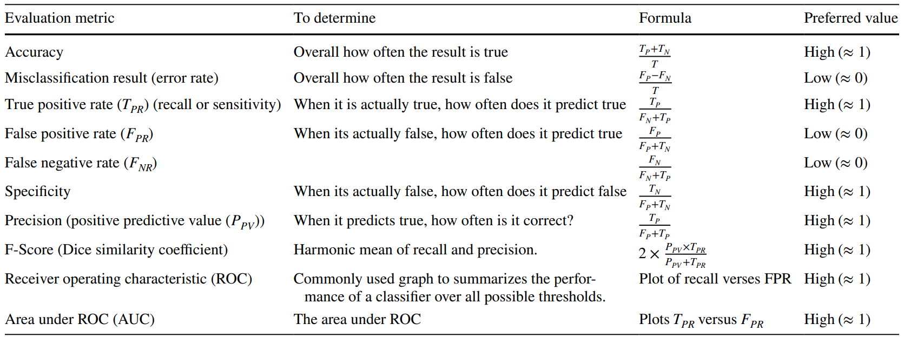
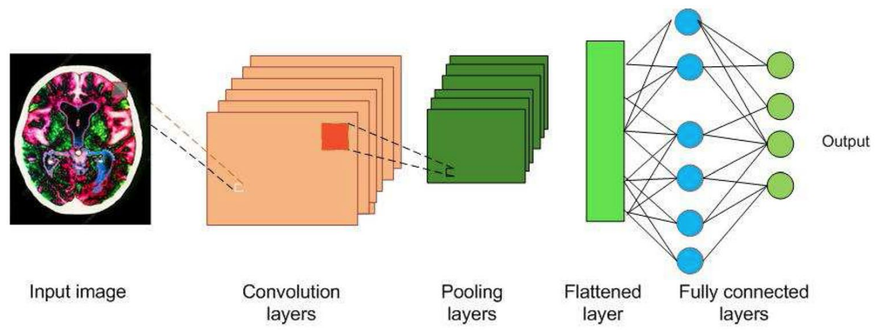
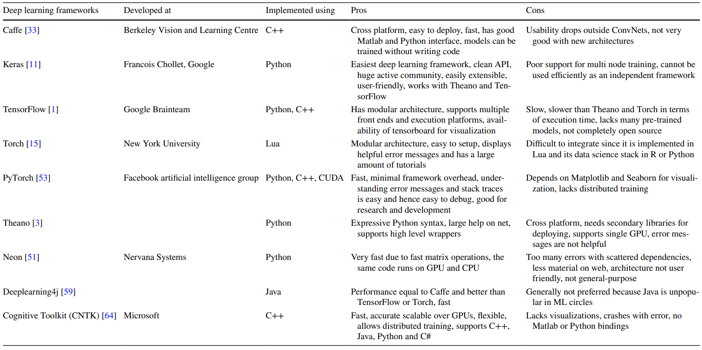
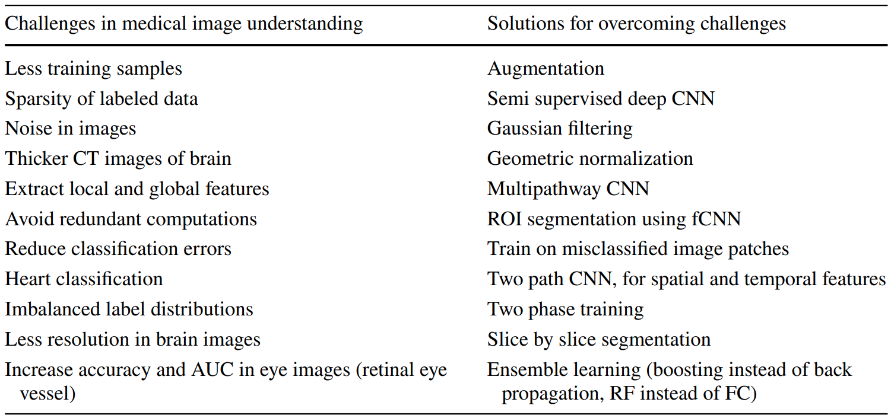

Convolutional neural networks in medical image understanding: a survey
==============================

Metadata
------------

| Title               | [Convolutional neural networks in medical image understanding: a survey](https://doi.org/10.1007/s12065-020-00540-3) |
|:--------------------|:---------------------------------------------------------------------------------------------------------------------|
| **Authors**         | D. R. Sarvamangala Raghavendra V. Kulkarni                                                                       |
| **Publisher**       | Springer                                                                                                             |
| **Publishing Date** | January 2021                                                                                                         |
| **DOI**             | [https://doi.org/10.1007/s12065-020-00540-3](https://doi.org/10.1007/s12065-020-00540-3)                             |

Abstract
------------

* Imaging techniques are used to capture anomalies of the human body
* Medical image understanding is generally performed by skilled medical professionals. However, the scarce availability
  of human experts and the fatigue and rough estimate procedures involved with them limit the effectiveness of image
  understanding performed by skilled medical professionals
* Convolutional neural networks (CNNs) are effective tools for image understanding
* The article aims to provide a comprehensive survey of applications of CNNs in medical image understanding
* The paper will mainly attempt to discuss the following:
    * A brief introduction to CNNs
    * Present various award-winning frameworks of the CNN
    * Introduce image classification, segmentation, localization and detection
    * Survey the applications of CNN in medical image understanding of the ailments of brain, breast, lung and other
      organs
    * Presented critical discussion on some challenges

Introduction
------------

* Medical anomalies include:
    * Glaucoma
    * Diabetic retinopathy
    * Tumors
    * Interstitial lung diseases
    * Heart diseases
    * Tuberculosis
* Such medical anomalies can cause loss of human lives, it can be reduced with timely diagnosis of them
* Medical images can be sourced from:
    * X-ray
    * Magnetic resonance imaging (MRI)
    * Computed tomography (CT)
    * Positron emission tomography (PET)
    * Single photon emission computed tomography
    * Ultrasound scanning
* Image understanding involves the detection of anomalies, ascertaining their locations and borders, and estimating
  their sizes and severity
* The scarce availability of human experts and their fatigue, high consultation charges and rough estimate procedures
  limit the effectiveness of image understanding
* Shapes, locations and structures of the medical anomalies are highly variable. Making diagnosis difficult even for
  specialized physicians
* This is the motivation for intelligent image understanding systems
* Machine learning (ML) techniques include:
    * Decision tree learning
    * Clustering
    * Support vector machines (SVMs)
    * K-means nearest neighbor (K-NN)
    * Restricted Boltzmann machines (RBMs)
    * Random forests (RFs)
* The pre-requisite for ML techniques to work efficiently is the extraction of discriminant features. And these features
  are generally unknown and is also a very challenging task especially for applications involving image understanding
* Solution: Create intelligent machines which could learn features needed for image understanding and extract it on its
  own, such as convolutional neural network (CNN)
* CNN automatically learns the needed features and extracts it for medical image understanding
* CNN has been used widely due to its high accuracy

### Motivation and purpose

* CNN-based approaches are placed in the leader board of the many image understanding challenges,such as:
    * Medical Image Computing and Computer Assisted Intervention (MICCAI) biomedical challenge
    * Brain Tumor segmentation (BRATS) multimodal Brain Tumor Segmentation challenge
    * Imagenet classification challenge
    * Challenges of International Conference on Pattern Recognition (ICPR)
    * Ischemic Stroke Lesion Segmentation (ISLES) challenge
* Medical image applications of CNN:
    * Detection of tumors and their classification into benign and malignant
    * Detection of skin lesions
    * Detection of optical coherence tomography images
    * Detection of:
        * Colon cancer
        * Blood cancer
    * Anomalies of the:
        * Heart
        * Breast
        * Chest
        * Eye
* CNNs have also dominated the area of COVID-19 detection using chest X-rays/CT scans
* A large number of research papers concerning CNN have been published
* The survey offers a comprehensive overview of applications and methodology of CNNs and its variants, in the fields of
  medical image understanding including the detection of the latest global pandemic COVID-19

### Contributions and the structure

* Contributions:
    * Briefly introduce medical image understanding and CNN.
    * Convey that CNN has percolated in the field of medical image understanding
    * Identify the various challenges in medical image understanding
    * Highlight contributions of CNN to overcome those challenges

Medical image understanding
------------

* Medical imaging is necessary for the visualization of internal organs for the detection of abnormalities in their
  anatomy or functioning
* Medical image capturing devices:
    * X-ray
    * CT
    * MRI
    * PET
    * Ultrasound scanners
* If an abnormality is detected, then its exact location, size and shape must be determined

### Medical image classification

* Involves determining and assigning labels to medical images from a fixed set
* Involves the extraction of features from the image, and assigning labels using the extracted features

### Medical image segmentation

* Helps in:
    * Image understanding
    * Feature extraction and recognition
    * Quantitative assessment of lesions or other abnormalities
* The objective of segmentation is to divide an image into regions that have strong correlations

### Medical image localization

* An important step towards automatic acquisition planning and post imaging analysis tasks
* Involves predicting the object in an image, drawing a bounding box around the object and labeling the object

### Medical image detection

* Aims at the classification and the localization of regions of interest in drawing bounding boxes around multiple
  regions of interest and labeling them
* Helps determine the exact locations of different organs and their orientation

### Evaluation metrics for image understanding

> #### Performance evaluation metrics
> 

Medical image understanding
------------

* Eyes capture the image, which is processed by the neurons and sent to the brain for interpretation
* Such process is complex for machines
* CNN is a deep learning algorithm inspired by the visual cortex of animal brain and aims to imitate the visual
  machinery of animals
* CNNs are made of convolutions having learnable weights and biases similar to neurons (nerve cells) of the animal

> #### Core building blocks of CNNs
> 

### Convolution layers (Conv layers)

* The visual cortex of the animal brain is made of neuronal cells which extract features of the images
* Each neuronal cell extracts different features, which help in image understanding
* The conv layer is modeled over the neuronal cells and its objective is to extract features, such as:
    * Edges
    * Colors
    * Texture
    * Gradient orientation
* Conv layers are made of learnable filters called convolutional filters (kernels)
* During the forward pass, the kernels are convolved across the width and height of input volume and dot product is
  computed between the entries of the filter and the input.
* The CNN learns filters that gets activated when they come across edge, colors, texture etc.
* The output of the conv layer is fed into an activation function layer

### Activation functions or nonlinear functions

* Used for nonlinear transformation of the data
* Ensures that the representation in the input space is mapped to a different output space as per the requirements
* Common activation functions:
    * Sigmoid: takes a real-valued number x and squashes it into range between 0 and 1
    * Tan hyperbolic: takes a real valued number x and squashes it between −1 to 1
    * Rectified linear unit (ReLU): takes a real valued number x and converts x to 0 if x is negative (Most often used
      nonlinear function for CNN, since it has a relatively low computation time)

### Pooling

* Performs nonlinear down sampling of convolved feature
* Decreases the computational power required to process the data through dimensionality reduction
* Reduces the spatial size by aggregating data over space or feature type
* Controls overtiring and overcomes translation and rotational variance of images
* Partitions the input into a set of rectangle patches, each patch gets replaced by a single value depending on the type
  of pooling selected

### Fully connected (FC) layer

* Similar to artificial neural network, where each node has incoming connections from all the inputs and all the
  connections have weights associated with them
* The output is sum of all the inputs multiplied by the corresponding weights.
* FC layer is followed by sigmoid activation function and performs the classifier job

### Data preprocessing and augmentation

* Raw images obtained from imaging modalities need to be preprocessed and augmented before sending to CNN
* Raw image data might be:
    * Skewed
    * Altered by bias distortion
    * Have intensity inhomogeneity during capture
* CNN needs to be trained on a larger dataset to achieve the best performance
* Data augmentation increases the existing set of images by:
    * Horizontal and vertical flips
    * Transformations
    * Scaling
    * Random cropping
    * Color jittering
    * Intensity variations

### CNN architectures and frameworks

* CNN frameworks (toolkits) enable the efficient development and implementation of deep learning methods
* Various award-winning CNN architectures:
    * LeNet-5
    * AlexNet
    * Overfeat
    * ZFNet
    * VGGNet
    * GoogLeNet
    * ResNet
    * Xception

> #### Various existing CNN frameworks
> 

CNN applications in medical image classification
------------

### Lung diseases

* Interstitial lung disease (ILD) is the disorder of lung parenchyma in which lung tissues get scarred leading to
  respiratory difficulty
* High resolution computed tomography (HRCT) imaging is used to differentiate between different types of ILDs
* HRCT images have a high visual variation between different classes and high visual similarity within the same class
* CNN techniques in medical image **classification** for **lung diseases** that has been used in research papers:
    * Ensemble CNN
    * Small‑kernel CNN
    * Whole image CNN
    * Multicrop pooling CNN

### Coronavirus disease 2019 (COVID‑19)

* A global pandemic disease spreading rapidly around the world
* Reverse Transcription Polymerase Chain Reaction (RT-PCR) is a commonly employed test for detection of COVID-19
  infection
* RT-PCR is very complicated, time-consuming and labor-intensive process, sparse availability and not very accurate
* Chest X-ray could be used for the initial screening of the COVID-19 in places having shortage of RT-PCR kits and is
  more accurate at diagnosis
* CNN techniques in medical image **classification** for **coronavirus disease 2019 (COVID‑19)** that has been used in
  research papers:
    * Customized CNN
    * Bayesian CNN
    * PDCOVIDNET
    * CVR‑Net
    * Twice transfer learning CNN

### Immune response abnormalities

* Result from an abnormal immune response to a normal body part
* The immune system of the body attacks the healthy cells in such diseases
* Indirect immunofluorescence (IIF) on human epithelial-2 (HEp-2) cells is used to diagnose an autoimmune disease
* Manual identification of these patterns is a time-consuming process
* CNN techniques in medical image **classification** for **immune response abnormalities** that has been used in
  research
  papers:
    * CUDA ConvNet CNN
    * Six‑layer CNN

### Breast tumors

* The most common cancer that affects women across the world
* Can be detected by the analysis of mammographs
* CNN techniques in medical image **classification** for **breast tumors** that has been used in research papers:
    * Stopping monitoring CNN
    * Ensemble CNN
    * Semi‑supervised CNN

### Heart diseases

* Electrocardiogram (ECG) is used for the assessment of the electrical activity of the heart to detect anomalies in the
  heart
* CNN techniques in medical image **classification** for **heart diseases** that has been used in research papers:
    * One‑dimensional CNN
    * Fused CNN

### Eye diseases

* CNN techniques in medical image **classification** for **eye diseases** that has been used in research papers:
    * Gaussian initialized CNN
    * Hyperparameter tuning inception‑v4

### Colon cancer

* CNN techniques in medical image **classification** for **colon cancer** that has been used in research papers:
    * Ensemble CNN

### Brain disorders

* MRI is used to obtain detailed images of the brain to diagnose tumors
* Automatic segmentation of a brain tumor is very challenging because it involves the extraction of high level features
* CNN techniques in medical image **classification** for **brain disorders** that has been used in research papers:
    * Fused CNN
    * Input cascaded CNN

CNN applications in medical image segmentation
------------

### Brain tumors

* MRI is used to obtain detailed images of the brain to diagnose tumors
* Automatic segmentation of a brain tumor is very challenging because it involves the extraction of high level features
* CNN techniques in medical image **segmentation** for **brain tumors** that has been used in research papers:
    * Small kernel CNN
    * Fully blown CNN
    * Multipath CNN
    * Cascaded CNN
    * Multiscale CNN
    * Multipath and multiscale CNN

### Breast cancer

* Breast cancers can be predicted by automatically segmenting breast density and by characterizing mammographic textural
  patterns
* CNN techniques in medical image **segmentation** for **breast cancer** that has been used in research papers:
    * FCNN
    * Probability map CNN
    * Patch CNN

### Eye diseases

* CNN techniques in medical image **segmentation** for **eye diseases** that has been used in research papers:
    * Greedy CNN
    * Multi label inference CNN

### Lung

* CNN techniques in medical image **segmentation** for **lung** that has been used in research papers:
    * U net

CNN applications in medical image detection
------------

### Breast tumors

* CNN techniques in medical image **detection** for **breast tumors** that has been used in research papers:
    * GoogLeNet CNN

### Eye diseases

* CNN techniques in medical image **detection** for **eye diseases** that has been used in research papers:
    * Dynamic CNN
    * Ensemble CNN

### Cell division

* CNN techniques in medical image **detection** for **cell division** that has been used in research papers:
    * LeNet CNN

CNN applications in medical image localization
------------

### Breast tumors

* CNN techniques in medical image **localization** for **breast tumors** that has been used in research papers:
    * Semi‑supervised deep CNN

### Heart diseases

* CNN techniques in medical image **localization** for **heart diseases** that has been used in research papers:
    * Pyramid of scales localization

### Fetal abnormalities

* CNN techniques in medical image **localization** for **fetal abnormalities** that has been used in research papers:
    * Transfer learning CNN

Critical review and conclusion
------------

* CNNs have been successfully applied in the areas of medical image understanding
* This section provides a critical review of applications of CNNs in medical image understanding
* Hyperparameters optimization (dropout rate, learning rate, optimizer etc.) help in enhancing or declining the
  performance of a network
* CNNs require exhaustive amounts of data containing the most comprehensive information during training
* Insufficient information or features leads to underftting of the model, solution: augmentation
* Transfer learning and fne-tuning could also be used to enhance the efficiency in case of sparse availability of data
* Small-sized kernels could be used to enhance the performance by capturing low-level textual information. However, it
  is at the cost of increased computational complexity during training
* Multiple pathway architecture could be used to enhance performance of CNN (increases the computational burden on the
  processor and memory)
* One of the challenge involved in medical data is the class imbalance problem
* Designing CNNs to work on imbalanced data is a challenging task, solution: applying augmentation of the
  under-represented data
* Denser CNNs could also lead to the vanishing gradient problem, solution: use skip connections as in the inceptionNet
  architecture
* CNNs would be more efficient if the data consists of not only images, but also patient history

> #### Ways of addressing challenges of medical image understanding
> 

Conclusion
------------

* The heterogeneous nature of medical anomalies in terms of shape, size, appearance, location and symptoms poses
  challenges for medical anomaly diagnosis and prognosis
* ML-based healthcare systems need efficient feature extraction methods. But efficient features are still unknown or
  inefficient
* CNN is a popular technique for solving medical image understanding challenges due to its highly efficient methods of
  feature extraction and learning low-level, mid-level and high-level discriminant features of an input medical image
* The CNN methods discussed in this paper have been found to either outperform or compliment the existing traditional
  and ML approaches in terms of accuracy, sensitivity, AUC. However, their performance is often not the best due to a
  few factors
* CNN models have been described as black boxes and there is a lot of research happening in terms of analyzing and
  understanding output at every layer
* Researchers are also working on image captioning (textual representations of the image); enable physicians to
  understand the perception of the network at both output layer and intermediate levels

--------